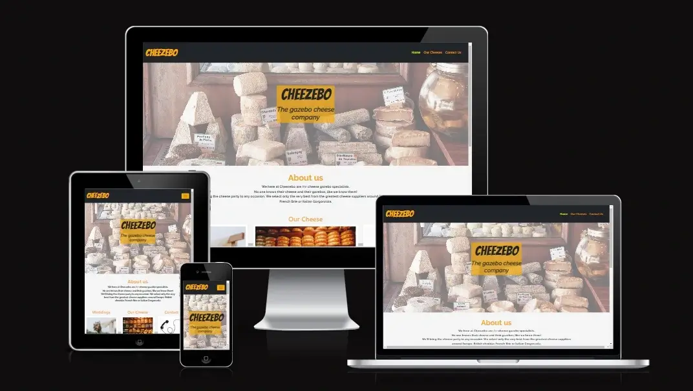
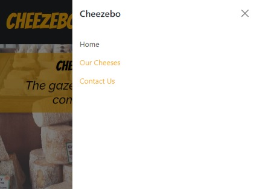
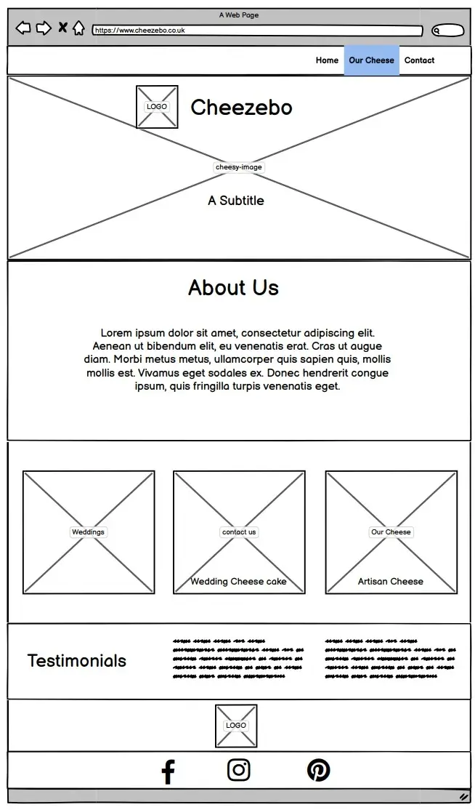
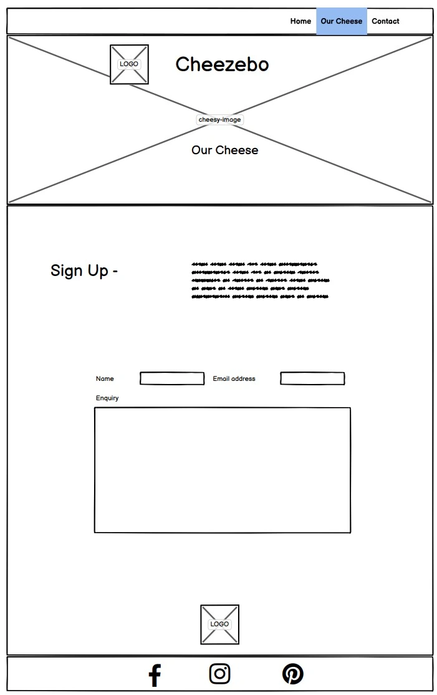

# Cheezebo

<h2 align="center"></h2>

[View the project here.](https://nddpj00.github.io/cheezebo-milestone1/)

This website was created to  promote an provide information about Cheezebo.  Cheezebo is a business idea offering a catering service which can be hired for special occasions such as weddings and birthdays.

Cheezebo will set up their gazebo at your event location, provide the finest cheese and offer advice and knowledge about their produce.

Designed for wedding organisers and party planners to find information of Cheezebo's services, products and via the contact page, make enquiries incuding availability and quotes.

## Features

-__Navigation Bar__-
-   Featured across all 3 pages, the navigation bar offers easy transitions from the Homepage, cheese page and sign-ups.  Responsive as it uses the nav (burger) logo on small devices but expands out to a larger more traditional navigation on larger screens. It makes use of Bootstraps 'Offcanvas fixed navbar' component to ensure ease of use.

- __The landing page image__

-Large background photo of some of the types of cheese that will be provided. Contrasting name brand on navigation bar to ensure users know theyre in the right place.  

- __About us information__

-This provides users information of the ethos of the company and brand. 

- __Testimonials__

-Provides quotes from previous customers to give users assurances that Cheezebo is a company that is trustworthy and has experience. 
-Also lets users know about how happy those previous customers were with the service provided

- __The Footer__ 

  - The footer section includes links to the relevant social media sites for Cheezebo. The links will open to a new tab to allow easy navigation for the user. 
  - The footer is valuable to the user as it encourages them to keep connected via social media

- __Our Cheese page__

-This page provides more details about the cheeses that Cheezebo specialise in. Includes information on the cheeses themselves , along with visuals.

- __The Contact Us Page__

  - This page will allow the user to get in touch with Cheezbo. This could be to gain availability on event dates or to request a quote. The user will be asked to submit their full name, email address and type of event (later via radio buttons). There is also a textarea provided to allow further information.

## User Experience (UX)

-   ### User stories

    -   #### First Time Visitor Goals

        1. As a First Time Visitor, I want to easily understand the main purpose of the site and learn more about the organisation.
        2. As a First Time Visitor, I want to be able to easily navigate throughout the site to find content.
        3. As a First Time Visitor, I want to look for testimonials to understand what their users think of them and see if they are trusted. I also want to locate their social media links to see their followings on social media to determine how trusted and known they are
	4. As a First Time Visitor, I want to be able to easily contact the organisation to enquire futher.

    -   #### Returning Visitor Goals

        1. As a Returning Visitor, I want to find information about updates on produce and services.
        2. As a Returning Visitor, I want to find the best way to get in contact with the organisation with any questions I may have.
        3. As a Returning Visitor, I want to find social links.

    -   #### Frequent User Goals
        1. As a Frequent User, I want to check to see if there are any newly added testimonials from recent customers.
        2. As a Frequent User, I want to check to see if there are any new products offered.
        3. As a Frequent User, I want to contact the organisation with any further queries I may have.

-   ### Design
    -   #### Colour Scheme
  -   The two main colours used are Black and Yellow/Orange rgba (247, 172, 11).
    -   #### Typography
        -   The Bangers font is used for the name of the company ‘Cheezebo’ which is in part its logo too.  Its used as a comic style font which helps bring a fun, modern feel to the company. The majority of the remaining font used is Raleway which compliments well with the comic style Bangers. Sans-serif is added as the back-up font in case Bangers or Raleway isnt supported.
    -   #### Imagery
        -   Large background hero images are used to allow users to quickly understand they’ve reached a cheese catering company and to offer an idea of the large variety that can be supplied.

*   ### Wireframes

    -   ![Home Page Wireframe]

    -   ![Our Cheese page Wireframe]

    -   ![Contact Us Page Wireframe]
