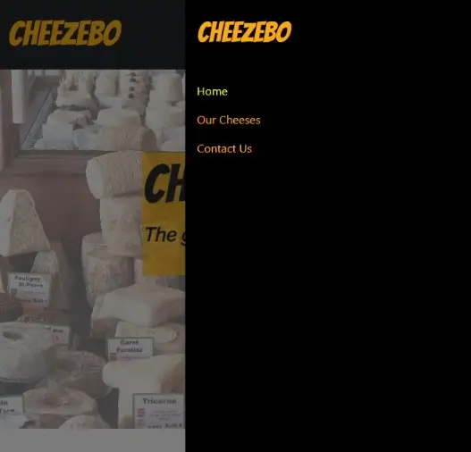
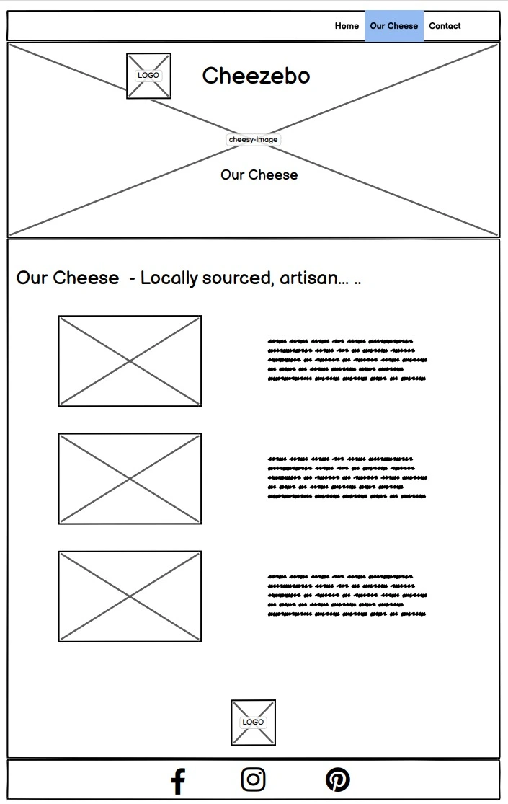
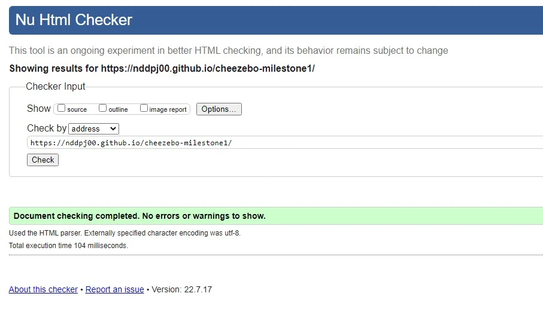
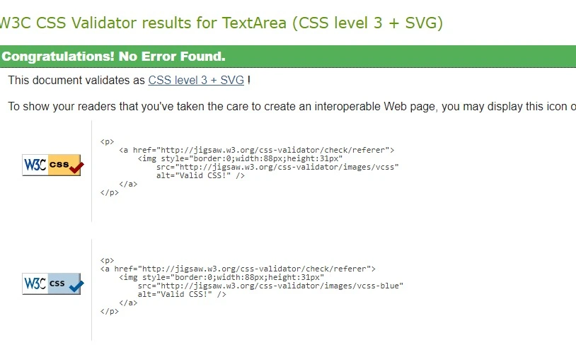

# Cheezebo


<h2 align="center"></h2>

[View the project here.](https://nddpj00.github.io/cheezebo-milestone1/)

This website was created to  promote an provide information about Cheezebo.  Cheezebo is a business idea offering a catering service which can be hired for special occasions such as weddings and birthdays.

Cheezebo will set up their gazebo at your event location, provide the finest cheese and offer advice and knowledge about their produce.

Designed for wedding organisers and party planners to find information of Cheezebo's services, products and via the contact page, make enquiries incuding availability and quotes.

## Features

-__Navigation Bar__-
-   Featured across all 3 pages, the navigation bar offers easy transitions from the Homepage, cheese page and sign-ups.  Responsive as it uses the nav (burger) logo on small devices but expands out to a larger more traditional navigation on larger screens. It makes use of Bootstraps 'Offcanvas fixed navbar' component to ensure ease of use.




- __The landing page image__

-Large background photo of some of the types of cheese that will be provided. Contrasting name brand on navigation bar to ensure users know theyre in the right place.  

- __About us information__

-This provides users information of the ethos of the company and brand. 

- __Testimonials__

-Provides quotes from previous customers to give users assurances that Cheezebo is a company that is trustworthy and has experience. 
-Also lets users know about how happy those previous customers were with the service provided

- __The Footer__ 

  - The footer section includes links to the relevant social media sites for Cheezebo. The links will open to a new tab to allow easy navigation for the user. 
  - The footer is valuable to the user as it encourages them to keep connected via social media.
  - An Email address is also provided which contains a link to open up the users preferred email programme. Changes colour to identify its a link.

- __Our Cheese page__

-This page provides more details about the cheeses that Cheezebo specialise in. Includes information on the cheeses themselves , along with visuals.

- __The Contact Us Page__

  - This page will allow the user to get in touch with Cheezbo. This could be to gain availability on event dates or to request a quote. The user will be asked to submit their full name, email address and type of event  (via radio buttons). There is also a textarea provided to allow further details to be included.


## User Experience (UX)

-   ### User stories

    -   #### First Time Visitor Goals

        1. As a First Time Visitor, I want to easily understand the main purpose of the site and learn more about the organisation.
        2. As a First Time Visitor, I want to be able to easily navigate throughout the site to find content.
        3. As a First Time Visitor, I want to look for testimonials to understand what their users think of them and see if they are trusted. I also want to locate their social media links to see their followings on social media to determine how trusted and known they are.
	    4. As a First Time Visitor, I want to be able to easily contact the organisation to make futher enquiries.

    -   #### Returning Visitor Goals

        1. As a Returning Visitor, I want to find information about updates on produce and services.
        2. As a Returning Visitor, I want to find the best way to get in contact with the organisation with any questions I may have.
        3. As a Returning Visitor, I want to find social links.

    -   #### Frequent User Goals
        1. As a Frequent User, I want to check to see if there are any newly added testimonials from recent customers.
        2. As a Frequent User, I want to check to see if there are any new products offered.
        3. As a Frequent User, I want to contact the organisation with any further queries I may have.

-   ### Design
    -   #### Colour Scheme
    -   The two main colours used are Black and Yellow/Orange rgba (247, 172, 11).
-   #### Typography
    -   The Bangers font is used for the name of the company. The remaining is Raleway with    a backup of sans-serif.
-   #### Imagery
        - Large background hero images are used to allow users to quickly understand they’ve reached a cheese catering company and to offer an idea of the large variety that can be supplied.

*   ### Wireframes

    -   ![Home Page Wireframe]

    -   ![Our Cheese page Wireframe]

    -   ![Contact Us Page Wireframe]


## Features

-   Responsive on all device sizes

-   Interactive elements

## Technologies Used

### Languages Used

-   [HTML5](https://en.wikipedia.org/wiki/HTML5)
-   [CSS3](https://en.wikipedia.org/wiki/Cascading_Style_Sheets)

### Frameworks, Libraries & Programs Used

1. [Bootstrap v5:]( https://getbootstrap.com/docs/5.0/getting-started/introduction/)
    - Bootstrap was used to assist with the responsiveness and styling of the website.
1. [Google Fonts:](https://fonts.google.com/)
    - Google fonts were used to import the 'Bangers' and ‘Raleway’ fonts into the style.css file which is used on all pages throughout the project.
1. [jQuery:](https://jquery.com/)
    - jQuery came with Bootstrap to make the navbar responsive but was also used for the smooth scroll function in JavaScript.
1. [Git](https://git-scm.com/)
    - Git was used for version control by utilizing the Gitpod terminal to commit to Git and Push to GitHub.
1. [GitHub:](https://github.com/)
    - GitHub is used to store the projects code after being pushed from Git.
1. [Pixelied:](https://pixelied.com/features/make-jpg-transparent)
    - Pixelied, was used to edit hero image photo.
1. [Balsamiq:](https://balsamiq.com/)
    - Balsamiq was used to create the [wireframes](https://github.com/) during the design process.
1. [Convertio:](https://convertio.co/)
    - Convertio was used to convert jpeg files to webp to compress images and offer faster loadtimes.
1. [tinypng](https://tinypng.com)
    - Tinypng was also used to further compress the images used. Again to offer faster load times.
1. [Font Awesome](https://fontawesome.com/)    
    - Used to add social media links.

## Testing

The W3C Markup Validator and W3C CSS Validator Services were used to validate every page of the project to ensure there were no syntax errors in the project.

-   [W3C Markup Validator](https://validator.w3.org/) - [Results](https://validator.w3.org/nu/?doc=https%3A%2F%2Fnddpj00.github.io%2Fcheezebo-milestone1%2F)

-   [W3C CSS Validator](https://jigsaw.w3.org/css-validator/#validate_by_input) - [Results](https://jigsaw.w3.org/css-validator/validator#css)

### Testing User Stories from User Experience (UX) Section

-   #### First Time Visitor Goals

    1. As a First Time Visitor, I want to easily understand the main purpose of the site and learn more about the organisation.

        1. Upon entering the site, users are automatically greeted with a clean and easily readable navigation bar to go to the page of their choice. Underneath there is a Hero Image with Text and About Us text providing info on what the organisation does.
        2. The branding and imagery as clear and ensure user knows the companies sector.
        3. The user has two options, click the navigational links or scroll down, the top of the new section is visible to ensure user knows there is information below.

    2. As a First Time Visitor, I want to be able to easily be able to navigate throughout the site to find content.

        1. The site has been designed to be fluid and never to entrap the user. At the top of each page there is a clean navigation bar, each link describes what the page they will end up at clearly.
        2. The navigation bar is fixed to the top of the screen so the user won’t feel trapped as they get to the bottom of the page.

    3. As a First Time Visitor, I want to look for testimonials to understand what their users think of them and see if they are trusted. I also want to locate their social media links to see their following on social media to determine how trusted and known they are.
        1. Once the new visitor has read the About Us section they will notice the testimonial section, letting them know of recent feedback received by customer..
        2. The user can also scroll to the bottom of any page on the site to locate social media links in the footer.
        

-   #### Returning Visitor Goals

    1. As a Frequent User, I want to check to see if there are any newly added testimonials from recent customers.

        1. These are clearly shown under the labelled ‘testimonial’ section.
        2. Opening the links for Facebook and Instagram will present recent customers comments and photos.

    2. As a Returning Visitor, I want to find the best way to get in contact with the organisation with any questions I may have.

        1. The navigation bar clearly highlights the "Contact Us" Page.
        2. Here they can fill out the form on the page or are told that alternatively they can message the organisation on social media.
        3. The footer contains links to the organisations Facebook, Instagram and Pinterest pages as well as the organization's email.
        4. Whichever link they click, it will be open up in a new tab to ensure the user can easily get back to the website.

    3. As a Returning Visitor, I want to find the Facebook Group link so that I can join and interact with others in the community.
        1. The Facebook Page can be found at the footer of every page and will open a new tab for the user and more information can be found on the Facebook page.

-   #### Frequent User Goals

    1.  As a Frequent User, I want to check to see if there are any newly added testimonials from recent customers.

        1. The user would already be comfortable with the website layout and can easily scroll to the testimonial area or social links.

    2. As a Frequent User, I want to check to see if there are any new products offered.

        1. The user would already be comfortable with the website layout and can easily click the links to our cheeses page, from the nav bar or image on the homepage.

	  3. As a Frequent User, I want to contact the organisation with any further queries I may have. 

	      1. A fixed nav bar ensures the user can select the Contact us page regardless of their position 
          on site.
        2. Clickable images and links to the contact page exist on the homepage.
        3. There is a "Submit" button to the right hand side of the input field which is located close 
            to the field and can easily be distinguished.
	      4. Directed to the social media sites for updates and further information.

### Further Testing

-   The Website was tested on Google Chrome, Microsoft Edge and Safari browsers.
-   The website was viewed on a variety of devices such as Desktop, Laptop, Pixel 6, iPhone 8 & iPhone XR.
-   A large amount of testing was done to ensure that all pages were linking correctly.
-   Friends and family members were asked to review the site and documentation to point out any bugs and/or user experience issues.

### Known Bugs
No known bugs


## Deployment

### GitHub Pages

The project was deployed to GitHub Pages using the following steps...

1. Log in to GitHub and locate the [GitHub Repository](https://github.com/)
2. At the top of the Repository (not top of page), locate the "Settings" Button on the menu.
    - Alternatively Click [Here](https://raw.githubusercontent.com/) for a GIF demonstrating the process starting from Step 2.
3. Scroll down the Settings page until you locate the "GitHub Pages" Section.
4. Under "Source", click the dropdown called "None" and select "Master Branch".
5. The page will automatically refresh.
6. Scroll back down through the page to locate the now published site [link](https://github.com) in the "GitHub Pages" section.

### Forking the GitHub Repository

By forking the GitHub Repository we make a copy of the original repository on our GitHub account to view and/or make changes without affecting the original repository by using the following steps...

1. Log in to GitHub and locate the [GitHub Repository](https://github.com/)
2. At the top of the Repository (not top of page) just above the "Settings" Button on the menu, locate the "Fork" Button.
3. You should now have a copy of the original repository in your GitHub account.

### Making a Local Clone

1. Log in to GitHub and locate the [GitHub Repository](https://github.com/)
2. Under the repository name, click "Clone or download".
3. To clone the repository using HTTPS, under "Clone with HTTPS", copy the link.
4. Open Git Bash
5. Change the current working directory to the location where you want the cloned directory to be made.
6. Type `git clone`, and then paste the URL you copied in Step 3.

```
$ git clone https://github.com/YOUR-USERNAME/YOUR-REPOSITORY
```

7. Press Enter. Your local clone will be created.

```
$ git clone https://github.com/YOUR-USERNAME/YOUR-REPOSITORY
> Cloning into `CI-Clone`...
> remote: Counting objects: 10, done.
> remote: Compressing objects: 100% (8/8), done.
> remove: Total 10 (delta 1), reused 10 (delta 1)
> Unpacking objects: 100% (10/10), done.
```

Click [Here](https://help.github.com/en/github/creating-cloning-and-archiving-repositories/cloning-a-repository#cloning-a-repository-to-github-desktop) to retrieve pictures for some of the buttons and more detailed explanations of the above process.

## Credits

### Code

-   [Bootstrap5](https://getbootstrap.com/docs/5.0/examples/) 
The offcanvas navigation bar used was using bootstrap 5 example code. 
The thumbnails for weddings/Our cheese/ contact us were created using Bootstrap grid system. 
The submit button on the sign up form was created using Bootstrap 5 buttons. 
The testimonial quotes were created using Bootstrap 5 Card component.


### Content

-   All content was written by the developer.


### Media

-   [Unsplash]( https://unsplash.com/)All photos used came from unsplash.
-   [Font-Awesome](https://fontawesome.com/) Social media icons and down point icon

### Acknowledgements

-   My Mentor for continuous helpful feedback.

-   EKC course facilitator for introducing me to many new concepts and software and lots of great advice.
